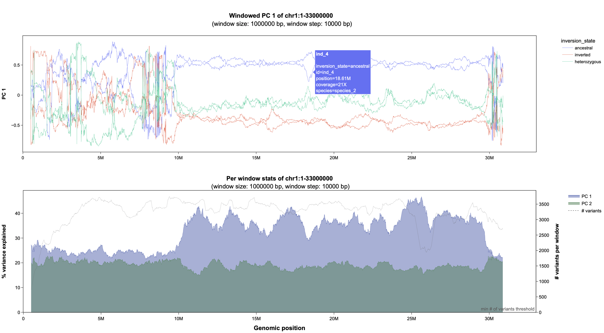

# **About**

*This is becoming a collection of scripts to investigate genetic structure along the genome.*

*If you find any of this useful and use it for your work, please consider citing this github.*

*For questions/problems: lmb215@cam.ac.uk*


<br />
<br />

**********

# **windowed_pca.py**
_Conduct PCAs in in genomic windows (using scikit-allel)_

<br />




## **Overview**
- useful to explore the variation/divergence landscape, and particularly to identify inversion polymorphisms in biallelic variant callsets
- generates PDF and interactive HTML plots (using plotly)
- input files: a biallelic VCF and a metadata file (details below) (instead of a VCF, a genotype file can be used as input; see below) 


## **Dependencies**
- scikit-allel (https://anaconda.org/conda-forge/scikit-allel)
- plotly (https://anaconda.org/plotly/plotly)
- gzip (https://anaconda.org/conda-forge/gzip)
- numpy (https://anaconda.org/anaconda/numpy)
- pandas (https://anaconda.org/anaconda/pandas)
- numba (https://anaconda.org/anaconda/numba)

--> easy to obtain using conda


## **Usage**

*Please refer to the Input Files section below to for file format specifiections.*

```
python3 windowed_pca.py <variant file> <metadata> <output prefix> <region> <window size> <window step> <minor allel frequency> <pc> <filter column name> <filter column value> <color column name> <guide samples>
```

*Help message*
<sub><sup>

| Argument | Type | Description |
| ----------------------- | --- | -------------------------------- | 
| **variant file**   | str | path to uncompressed or gzipped variant file (VCF or genotype file) |
| **metadata**          | str | path to the metadata file |
| **output prefix**     | str | prefix for output files |
| **region**   | str | target region in format "chr:start-stop" (i.e. chr1:1-$chrom_length to analyze the entire chr1) |
| **window size**       | int | sliding window size in bp, e.g. '1000000' |
| **window step** | int | sliding window step size in bp, e.g. '100000' |
| **minor allel frequency** | float | minor allel frequency threshold; specify "None" to disable filter |
| **pc** | int | principal component to use ('1' or '2') |
| **filter column name** | str | metadata column name to filter for individuals to includede in the analysis, e.g. 'genus' (see <filter column value>) |
| **filter column value** | str | value to be filtered for in filter column; Setting *filter column name* to 'genus' and *filter column value* to 'Homo' would include all individuals of the genus _Homo_ in the output, while ignoring all others. (a comma-separated list of include values is accepted, e.g. 'Homo,Pan') |
| **color column name** | str | metadata column to assign colors by in the output plot; if selecting 'genus', all individuals from the same genus will have the same color in the output plots; if specifying a comma-separated list like 'genus,species', one output plot is generated for each color scheme |
| **guide samples** | str | list of samples to use for polarization, e.g. 'ind1,ind2,ind3'; specify 'None' for automatic guide sample selection |
</sup></sub>


## **Example command line:**

*Usage example based on the supplied test dataset:*
```
python3 windowed_pca.py test_dataset/input/sample.vcf.gz test_dataset/input/metadata.tsv test_dataset/output/test_vcf_gt chr1:1-33000000 1000000 10000 None 1 id ind_1,ind_2,ind_3,ind_4,ind_5,ind_6 inversion_state ind_2
```


*This generates six output files*


1. Windowed PCA:
    1. ```${output_prefix}.w_pc_${pc}.tsv.gz``` contains all information relevant to the windowed PCA plots: it provides the value per principal component per window per individual, as well as all metadata and is used for plotting. It is also the file to be used for any custom plotting.
    2. ```${output_prefix}.pc_${pc}.${color_column_name}.html```: interactive HTML plot of the windowed PCA results, based on ```${output_prefix}.${chromosome_name}.pc_1.tsv```. if more than one color_column_name was specified, additional versions of this plot will be produced.
    3. ```${output_prefix}.pc_${pc}.${color_column_name}.pdf```: like the HTML file(s), just as PDF(s)
2. Supplementary info:
    1. ```${output_prefix}.w_stats.tsv.gz```: contains per window stats on the PCA results per window: % explained PC 1, % explained PC 2, # of included sites per window.
    2. ```${output_prefix}.w_stats.html```: interactive HTML plot of this per windows stats
    3. ```${output_prefix}.w_stats.pdf```: same as interactive HTML, just PDF


## **Please note:**
This is an improved version of earlier scripts. It has been tested extensively and should produce identical results, but please let me know if you notice any issues.

_The main improvements include:_
- instead of loading the entire genotype file into memory, only the current window is read, which 
should greatly reduce memory requirements (and potentially speed)
- Support for local windowed PCA (regions can now be specified, e.g. chr1:1000000-8000000
- VCF support
- improved per window stats plots
- guide sample specification elevated to proper command line option
- format for the genotype file slightly changed (REF + ALT columns dropped, as they are not used in the analysis) --> keep that in mind when working with existing input data
A copy of the previous version of the script is still available in ```legacy/windowed_pca_v1.py``` 

_Additional comments:_
- all columns in metadata will be included in hover display in HTML plots
- if output files (TSVs) from a previous run are detected (same output prefix), they will be reused for plotting instead of generating new ones
- the threshold for the minimum number of SNPs per window is set to 25 and can be adjusted in the modules/config.py
- in principal, any type of biallelic variants can be used as long as they are encoded as 0 (hom ref), 1 (het), 2 (hom alt), e.g. InDels ≤20 bp instead of SNPs
- a major challenge for windowed PCAs is that the PCA in each window is conducted independently, and rotation is random (--> noisy plots). The script implements a correction step that aims at polarizing the orientation based on variance and mean of the previous window, using a subset of 'guide samples'. Thne automatic guide sample selection is not always ideal. Therefore, after the first round of plotting, suited samples can often be visually determined (i.e. samples that never cross y=0). A single guide sample can be sufficient for correct polarization.

**********
<br />
<br />

# **windowed_pcangsd.py**
_Conduct PCAs on genotype likelihoods in in genomic windows (using PCAngsd)_

## **Overview**
- nearly the same as windowed_pca.py, but instead of scikit-allel depends on PCAngsd (Meisner & Albrechtsen, 2018) to conduct windowed PCAs on genotype likelihoods
- works on VCF files with PL (phred-scaled genotype likelihood) field, or on TSV files with three PL (phred-scaled genotype likelihood) or GL (genotype likelihood) fields per sample, as output by ANGSD
- requires PCAngsd to be installed and added to $PATH (easy to do by following the instructions: https://github.com/Rosemeis/pcangsd)
- can use multi-threading (numba file parsing and PCAngsd)

## **Dependencies**
- PCAngsd (https://github.com/Rosemeis/pcangsd)
- plotly (https://anaconda.org/plotly/plotly)
- gzip (https://anaconda.org/conda-forge/gzip)
- numpy (https://anaconda.org/anaconda/numpy)
- pandas (https://anaconda.org/anaconda/pandas)
- numba (https://anaconda.org/anaconda/numba)

--> all but PCAngsd can be obtained with conda

## **Usage**

*Please refer to the Input Files section below to for file format specifiections.*

```
python3 windowed_pca.py <variant file> <metadata> <output prefix> <region> <window size> <window step> <minor allel frequency> <pc> <filter column name> <filter column value> <color column name> <guide samples> <threads>
```

*--> one additional required command line argument: <threads>*
<sub><sup>

| Argument | Type | Description |
| ----------------------- | --- | -------------------------------- | 
| **threads**   | int | number of threads to be used [default is 2] |


## **Example command line:**

*Usage example based on the supplied test dataset, using 4 threads*
```
python3 windowed_pcangsd.py test_dataset/input/sample.pl.tsv.gz test_dataset/input/metadata.tsv test_dataset/output/test_pl_file chr1:1-33000000 1000000 10000 0.01 1 id ind_1,ind_2,ind_3,ind_4,ind_5,ind_6 inversion_state ind_2
```


*This generates the same output files as described above*

<br />
<br />

**********

# **Input Files**

_A sample file of each type is provided in_ ```test_dataset/input/```

## **Preparing a metadata file**
A metadata file is required to provide annotation for the HTML plots, and can also be used to control which samples to include in the windowed PCA analysis, and to assign groups that will have the same color in the plots.
The minimum requirement for the metadata file is that the first column contains unique identifiers for each sample, and is called 'id'. All additional fields are optional.
An example metadata file, which in addition to the id contains info on sequencing coverage, species and inversion state of each sample, is provided:
```
cat test_dataset/input/metadata.tsv
id      coverage        species inversion_state
ind_1   20X     species_1       ancestral
ind_2   21X     species_1       inverted
ind_3   20X     species_1       heterozygous
ind_4   21X     species_2       ancestral
ind_5   19X     species_2       inverted
ind_6   19X     species_2       heterozygous
```

## **Preparing a GT/PL/GL file from a VCF**
A file storing only genotypes or likelihoods can be much more space efficient than a full scale VCF. It contains only the chromosome name, position and per sample genotypes (encoded as 0=hom ref, 1=het, 2=hom alt, -1=missing data) or genotype likelihoods (three columns per sample, see https://samtools.github.io/hts-specs/VCFv4.2.pdf).
Below it is shown how to create such files based on the provided minimal information sample VCF.

```
# define a list of samples to be included in the genotype file (e.g if using only a subset of the VCF samples)
sample_ids='ind_1,ind_2,ind_3,ind_4,ind_5,ind_6,ind_7,ind_8,ind_9'
```
```
# derive header for GT file from VCF
bcftools query -s $samples -f 'CHROM\tPOS[\t%SAMPLE]\n' sample.vcf.gz | head -n 1 | gzip -c > sample.gt.tsv.gz

# convert VCF rows to GT file rows 
# - keep only lines without missing genotype calls
# - keep only biallelic SNPs that passed all filters
# - drop unnecessary VCF info (FORMAT, INFO columns)
bcftools view -s $samples -v snps -i 'F_MISSING=0' -m2 -M2 -f PASS sample.vcf.gz | bcftools query -f '%CHROM\t%POS[\t%GT]\n' | sed 's|\./\.|-1|g' | sed 's|0/0|0|g' | sed 's|1/1|2|g' | sed 's|0/1|1|g' | sed 's|1/0|1|g' | gzip -c >> sample.gt.tsv.gz
```
Have a look at the first rows of the GT file:
```
zcat sample.gt.tsv.gz | head -n 11
CHROM   POS     ind_1   ind_2   ind_3   ind_4   ind_5   ind_6
chr1    69964   0       0       0       0       0       0
chr1    70381   0       1       1       1       0       1
chr1    74191   0       0       0       0       0       0
chr1    83728   0       0       0       0       0       0
chr1    86817   0       0       0       0       0       0
chr1    87124   0       0       0       0       0       0
chr1    87362   0       0       0       0       0       0
chr1    87602   0       0       0       0       0       0
```

Likewise, a PL or GL file can be created, if the respective field is present in a VCF, below this is shown for PL, but GL would work the same (simply replace 'PL' with 'GL'):
```
# derive header for PL file from VCF (3 columns per sample)
bcftools query -s $samples -f 'CHROM\tPOS[\t%SAMPLE\t%SAMPLE\t%SAMPLE]\n' sample.vcf.gz | head -n 1 | gzip -c > sample.pl.tsv.gz

# convert VCF rows to PL file rows
# - this doesn't have to be limited to PASS sites and can include sites with missing called genotypes
# - drop unnecessary VCF info (FORMAT, INFO columns)
bcftools view -s $samples -v snps -m2 -M2 sample.vcf.gz | bcftools query -f '%CHROM\t%POS[\t%PL]\n' | tr ',' '\t' | gzip -c >> sample.pl.tsv.gz
```
Check out the first rows of the first three samples in the PL file:
```
zcat sample.gt.tsv.gz | head -n 11 | cut -f1-11
CHROM   POS     ind_1   ind_1   ind_1   ind_2   ind_2   ind_2   ind_3   ind_3   ind_3
chr1    69964   0       15      172     0       18      186     0       51      255
chr1    70381   0       90      255     37      0       200     48      0       166
chr1    74191   0       9       80      0       27      224     0       45      255
chr1    83728   0       6       58      0       9       95      0       33      255
chr1    86817   0       27      245     0       24      241     0       48      255
chr1    87124   0       27      240     0       36      255     0       42      255
chr1    87362   0       18      166     0       27      255     0       27      198
chr1    87602   0       18      174     0       39      255     0       75      255
chr1    87770   0       24      221     0       24      246     0       63      255
chr1    93309   0       21      132     0       18      143     0       15      134
```
