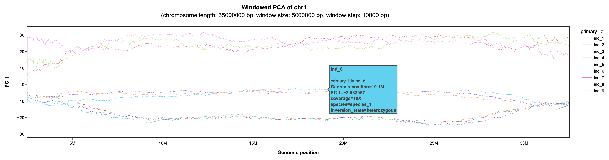

# Conduct PCAs in in genomic windows (using scikit-allel)



- useful to explore the variation/divergence landscape, and particularly to identify inversion polymorphisms in biallelic variant callsets
- generates PDF and interactive HTML plots (using plotly)
- input files: genotype file (easy to obtain from VCF) and a metadata file (details below)

## Python dependencies
- scikit-allel (https://anaconda.org/conda-forge/scikit-allel)
- plotly (https://anaconda.org/plotly/plotly)
- gzip (https://anaconda.org/conda-forge/gzip)
- numpy (https://anaconda.org/anaconda/numpy)
- pandas (https://anaconda.org/anaconda/pandas)

## Usage

The below instructions function as a tutorial (after cloning the repo and installing the dependencies).
```test_data/``` contains a sample VCF file (```test_data/input/sample_vcf.gz```) and a corresponding metadata file (```test_data/input/metadata.tsv```). The instructions below 
guide the user through all necessary steps from preparing a genotype file to running the ```windowed_pca.py``` script.

### Preparing a genotype file from a VCF file (biallelic SNPs)
Based on the provided minimal information sample VCF, generate a genotype file in the required format.
Below is one possible way to obtain a genotype file based on a VCF, but any other approach that results in the same format works.
Columns REF and ALT are not used by ```windowed_pca.py``` and can be replaced with dummy data.
```
# set $sample_vcf and $/genotype_file variables
sample_vcf=test_dataset/input/sample.vcf.gz
genotype_file=test_dataset/input/genotype_file.tsv.gz

# define a list of samples to be included in the genotype file (samples must be subset of input VCF samples)
sample_ids='ind_1,ind_2,ind_3,ind_4,ind_5,ind_6,ind_7,ind_8,ind_9'

# derive header for $genotype_file from $sample_vcf
bcftools view -h $sample_vcf | awk '$1=="#CHROM"' | cut -f 1,2,10- | tr -d '#' | gzip -c > $genotype_file

# convert VCF rows to $genotype_file rows 
# - keep only lines without missing genotype calls
# - keep only biallelic snps that passed all filters
# - drop unnecessary VCF info (FORMAT, INFO columns)
bcftools view -v snps -i 'F_MISSING=0' -m2 -M2 -f PASS $sample_vcf | bcftools query -f '%CHROM\t%POS\t[\t%GT]\n' | sed 's|\./\.|-1|g' | sed 's|0/0|0|g' | sed 's|1/1|2|g' | sed 
's|0/1|1|g' | sed 's|1/0|1|g' | gzip -c >> $genotype_file
```
Have a look at the first columns of the gentype file:
```
zcat ${genotype_file}.gz | head -n 15
CHROM   POS     REF     ALT     ind_1   ind_2   ind_3   ind_4   ind_5   ind_6   ind_7   ind_8   ind_9
chr1    10156   A       T       0       0       0       0       0       0       0       0       0
chr1    12814   A       G       0       0       0       0       0       0       0       0       0
chr1    12895   G       A       0       0       0       0       0       0       0       0       0
chr1    12957   G       A       0       0       0       0       0       0       0       0       0
chr1    55607   A       T       0       0       0       0       0       0       0       0       0
chr1    55728   A       T       0       0       0       0       0       0       0       0       0
chr1    55963   G       A       0       0       0       0       0       0       0       0       0
chr1    56234   A       G       0       0       0       0       0       0       0       0       0
chr1    56469   C       T       0       0       0       0       0       0       0       0       0
chr1    56724   T       C       2       1       1       1       0       0       2       2       1
chr1    56796   G       A       0       0       0       0       0       0       0       0       0
chr1    57369   C       T       0       0       0       0       0       0       0       0       0
chr1    57650   G       A       0       0       0       0       0       0       0       0       0
chr1    57865   A       C       0       0       0       0       0       0       0       0       0
```


### Preparing a metadata file
A metadata file is required to provide annotation for the HTML plots, and can also be used to control which samples to include in the windowed PCA analysis, and to assign groups that will have the same color in the plots.
The minimum requirement for the metadata file is that the first column contains unique identifiers for each sample, and is called 'id'. All additional fields are optional.
An example metadata file, which in addition to the id contains info on sequencing coverage, species and inversion state of each sample, is provided:
```
cat test_dataset/input/metadata.tsv
id      coverage        species inversion_state
ind_1   20X     species_1       inverted
ind_2   21X     species_1       inverted
ind_3   20X     species_1       inverted
ind_4   21X     species_1       heterozygous
ind_5   19X     species_1       heterozygous
ind_6   19X     species_1       heterozygous
ind_7   18X     species_2       uninverted
ind_8   26X     species_2       uninverted
ind_9   18X     species_2       uninverted
```

### Running windowed_pca.py
The python script requires 13 positional arguments, which are explained in more detail below:

```
python3 windowed_pca.py <genotype file> <metadata> <output prefix> <chromosome name> <chromosome length> <window size> <window step size> <filter column name> <filter column 
value> <color column name> <variance threshold> <mean threshold>
```

| Argument | Type | Description |
| ----------------------- | --- | -------------------------------- | 
| **genotype file**   | str | path to the genotype file |
| **metadata**          | str | path to the metadata file |
| **output prefix**     | str | prefix that will be used for all output files ('test/' would create a new directory as the prefix and all output files would be located therein) |
| **chromosome name**   | str | name of the chromosome, e.g. 'chr1' |
| **chromosome length** | int | length of the chromosome in bp, e.g. '35000000' |
| **window size**       | int | size of the sliding window in bp, e.g. '1000000' |
| **window step** | int | step size of the sliding window in bp, e.g. '100000' |
| **filter column name** | str | set a metadata column name to be used to select individuals to be included in the analysis e.g. 'species' (see filter column value for context) |
| **filter column value** | str | select a value to be filtered for in the defined filter column. Setting **filter column name** to 'species' and **filter column value** to 'species_1' would include all individuals of the species 'species_1' in the output, and ignore all others. To include more than one value, specify a comma-separated list (e.g. 'species_1,species_2') |
| **color column name** | str | select a metadata column that will serve to partition included individuals into color groups in the output plots. If selecting e.g. 'inversion_state', all individuals of the same inversion state (previously known and included in the metadata) will have the same color in the output plots. Specifying a comma-separated list of column names (e.g. 'species,inversion_state'), creates versions of each output plot that only differ in the color scheme |
| **variance threshold** | int | relevant to correct random switching along PC axes, see code for details, if unsure, use "9" |
| **mean threshold** | int | relevant to correct random switching along PC axes, see code for details, if unsure, use "3" |


#### Sample prompt 
```
python3 windowed_pca.py $genotype_file test_dataset/input/metadata.tsv test_dataset/output/ chr1 35000000 1000000 10000 id $sample_ids inversion_state 9 3
```
- the described genotype file (```test_dataset/input/genotype_file.tsv.gz```) and metadata file (```test_dataset/input/metadata.tsv```) are used as input files <genotype 
file> and <metadata>
- ```test_dataset/output/``` is set as the <output prefix>, which tells the script to create a new output directory ```test_dataset/output/``` (if it doesn't exist), and to create all output files therein
- 'chr1' and '35000000' are set for <chromosome name> and <chromosome length>
- <window size> is set to 1 Mbp ('1000000'), because the sample dataset is downsampled to 10% of the original SNPs, and a relatively large window size is required to have enough (>100) variants per window
- <step size> is set to 100,000 bp ('100000'), resulting in overlapping windows.
- <filter column name> is set to 'id' and <filter column value> to the previously defined $sample_ids variable to provide a list of samples to include (since \$sample_ids contains all samples in the metadata, all samples are included; to include e.g. only samples from species_1, set <filter column value> to 'species' and <filter column name> to 'species_1')
- <color column name> is set to 'inversion_state', resulting in all individuals with the same inversion states having the same color in the output sliding window plot
- <variance threshold> and <mean threshold> are set to the default values, for details see source code.


### Output files
Six output files are created by default, which can be grouped as follows:
1. Windowed PCA:
    1. ```${output_prefix}.${chromosome_name}.pc_1.tsv``` contains all information relevant to the windowed PCA plots: it provides the value per principal component per window per individual, as well as all metadata and is used for plotting. It is also the file to be used for any custom plotting.
    2. ```${output_prefix}.${chromosome_name}.pc_1.${color_column_name}.html```: interactive HTML plot of the windowed PCA results, based on ```${output_prefix}.${chromosome_name}.pc_1.tsv```. if more than one color_column_name was specified, additional versions of this plot will be produced.
    3. ```${output_prefix}.${chromosome_name}.pc_1.${color_column_name}.pdf```: like the HTML file(s), just PDF(s)
2. Supplementary info:
    1. ```${output_prefix}.${chromosome_name}.supplementary_info.tsv```: contains additional info on the PCA results per window: '% explained PC 1', '% explained PC 2', '% included sites'; all values are relative, '% included sites' is the percentage of included sites relative to the specified window size.
    2. ```${output_prefix}.${chromosome_name}.supplementary_info.html```: interactive HTML plot of this additional info
    3. ```${output_prefix}.${chromosome_name}.supplementary_info.pdf```: same as interactive HTML, just PDF


### Notes:
- WARNING: The entire genotype file is loaded into memory in the first step to speed up computation. This requires sufficient memory, depending on the size of the used callset.
- genotype file: REF/ALT fields are not used, they can be populated with dummy data
- Any biallelic variants can be used as lng as the are encoded as 0 (hom ref), 1 (het), 2 (hom alt). I have used InDels smaller 20 bp before and got nice results
- All columns in metadata will be included in hover display in HTML plots
- If output files (TSVs) from a previous run are detected (same output prefix), they will be reused for plitting instead of calculating new ones. This is useful to adjust the color scheme of the plots. To rerun everything from scratch, delete any existing output files.
- The threshold for the minimum number of SNPs per window is 100 and can be adjusted in the script. The lower the threshold, the noisier the plots.
- By default, plots are only produced for PC1, but it is easy to enable the creation of PC2 plots as well (takes 1 minute, see script for instructions)
- A major challenge for windowed PCAs is that the PCA in each window is conducted independently, and its rotation per principal component is thus random. This results in random switching along the component axis in the raw data, and very noisy plots. This script implements a correction step that aims at polarizing the orientation based on variance and mean of the previous window, using a specified number of the individuals with the most extreme values across the entire dataset (parameters <variance threshold> and <mean threshold>). This gives acceptable results for many tested datasets, but is not always ideal. It s sometimes worth testing different parameter combinations for <variance threshold> and <mean threshold>. If you have a better idea for the correction step, please let me know.
- please contact me if you have any questions or run into problems
